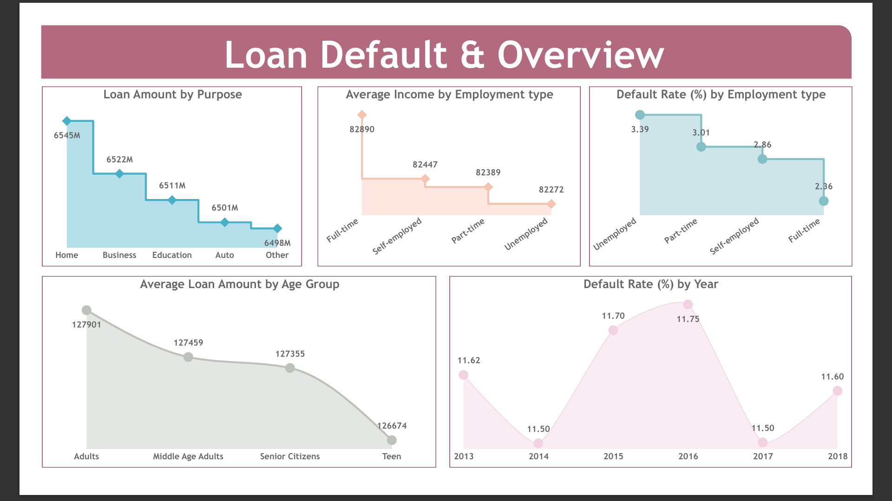
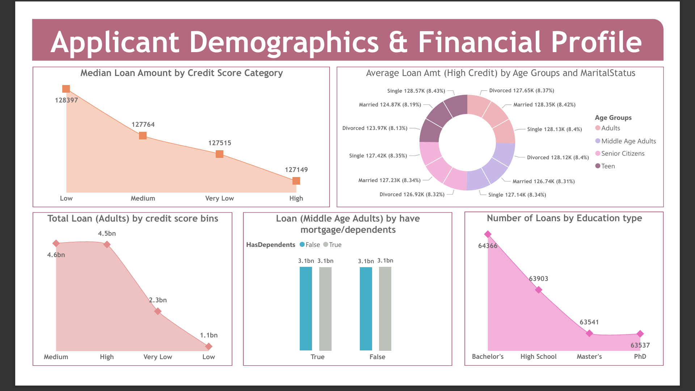
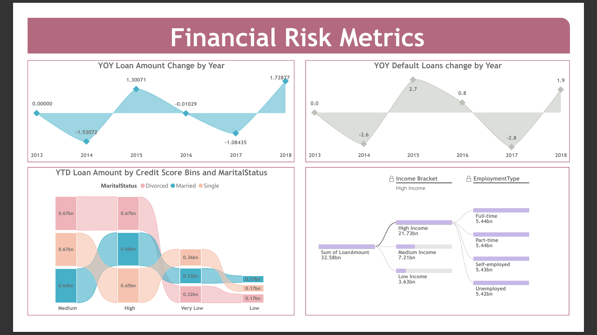

# loan-default-risk-analysis-powerbi
## 📥 Download Dashboard
The Power BI file is available in compressed format:[Download PBIX File](loan-default-dashboard.zip
# 📊 Loan Default Risk Analysis & Dashboard (Power BI)

# 📊 Loan Default Risk Analysis & Dashboard (Power BI)

## 🔍 Overview

This project analyzes loan default behavior using Power BI to identify high-risk customer segments and uncover financial trends. The solution integrates SQL Server for data extraction and Power BI for visualization, enabling data-driven decision-making through interactive dashboards.

---

## 🎯 Objectives

* Analyze loan default trends across multiple dimensions
* Identify high-risk customer segments
* Evaluate year-over-year (YOY) changes in loan and default rates
* Provide insights to support financial risk management

---

## 📁 Dataset

* Source: Loan dataset (stored in SQL Server)
* Total Loan Amount: ₹32.58B+
* Key Features:

  * Income, Employment Type
  * Credit Score
  * Age Group, Marital Status
  * Loan Purpose

---

## 🔄 Project Workflow

### 🔹 Data Collection

* Imported loan dataset into Microsoft SQL Server
* Extracted and queried data using SQL
* Connected SQL Server with Power BI for analysis

### 🔹 Data Cleaning & Preprocessing

* Performed data profiling in Power Query Editor
* Handled missing values and ensured data consistency
* Standardized categorical variables
* Converted data types for accurate analysis

### 🔹 Data Modeling

* Created derived columns:

  * Age Groups (Teen, Adults, Middle Age, Senior Citizens)
  * Income Brackets (Low, Medium, High)

### 🔹 DAX Calculations

* Developed key measures using DAX:

  * Total Loan Amount
  * Default Rate (%)
  * Average Income
  * YOY Loan Change (%)
  * YOY Default Change (%)

---

## 📊 Dashboard Preview

### 🔹 Loan Overview

### 🔹 Applicant Demographics & Financial Profile

### 🔹 Financial Risk Metrics

---

## 📈 Key Insights

* Unemployed customers show the highest default risk (~3.39%)
* High-income group contributes the majority of loan volume (~₹21.73B)
* Default rates fluctuate over time, indicating financial volatility
* Credit score significantly impacts loan distribution and risk

---

## 🛠 Tools & Technologies

* Power BI
* DAX (Data Analysis Expressions)
* Microsoft SQL Server
* Power Query
* Data Modeling
* Data Visualization

---

## 📂 Project Files

* Dataset: `/data/loan_default.csv` (or SQL source)
* Dashboard (PBIX): `loan-default-dashboard.pbix` or ZIP
* Screenshots: `/images/`
* Report (PDF): `/reports/loan-default-dashboard-report.pdf`

---

## 🚀 Business Impact

This dashboard helps financial institutions:

* Identify high-risk customer segments
* Improve loan approval strategies
* Monitor default trends over time
* Enable data-driven financial decisions

---

## 🔮 Future Improvements

* Build automated data pipeline using SQL + Power BI
* Implement real-time data integration
* Add machine learning model for default prediction

---

## 👤 Author

**Brijesh Kumar**
